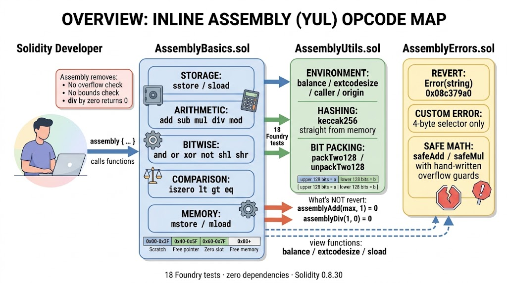

<div align="center">
  <h1>🧠 Assembly Basics — Core EVM Opcodes in Yul</h1>
  <p><b>A hands-on Solidity reference for storage, arithmetic, bitwise, memory and error handling through inline assembly</b></p>
</div>

## 📖 About the Project

**Assembly Basics** is a production-ready learning reference built with **Solidity** `0.8.30` and thoroughly tested using the **Foundry** framework. It exposes the fundamental EVM opcodes — `sstore`, `sload`, `add`, `mul`, `shl`, `mstore`, `keccak256` and `revert` — through small, isolated functions so that every concept can be read, called and verified on its own, without a framework or a deployment in the way.

The repository is deliberately dependency-free: there is no OpenZeppelin, no proxy pattern and no application logic. Each function documents the exact opcode it uses, its gas cost and the safety guarantee that Solidity removes the moment you drop into `assembly { }`. That makes it useful both as a study path for engineers moving from Solidity to Yul, and as a reference to copy proven patterns from — bit packing a storage slot, hashing straight out of memory, or building a custom-error revert by hand.

**Key Technical Highlights:**
* **Solidity `0.8.30`:** Modern compiler, zero external contract dependencies — the entire codebase is EVM opcodes and comments.
* **Foundry Framework:** An 18-case suite that asserts the exact behavior of every opcode, including the ones that silently wrap instead of reverting.
* **Gas-first mindset:** Documents real costs — `sstore` at ~20,000 gas for the first write, bitwise operations at 3 gas — and shows how packing two `uint128` values into one slot saves an entire storage write.
* **Safety documentation:** Every unsafe opcode is labelled, because assembly arithmetic does **not** revert on overflow and `div`/`mod` by zero return `0` instead of failing.
* **EVM-only capabilities:** `extcodesize`, `balance`, `caller` and `origin` accessed directly, plus manual `Error(string)` and custom-error encoding.

---

## ⚙️ How It Works

The codebase is organised in three contracts, each covering a stage of the same learning path. `AssemblyBasics` walks through the five foundational sections — storage (`sstore`/`sload`), arithmetic, bitwise operations, comparisons and memory (`mstore`/`mload`) — including the memory layout Solidity reserves for itself: `0x00-0x3F` scratch space, `0x40-0x5F` free memory pointer, `0x60-0x7F` zero slot, and `0x80` onward for allocation.

`AssemblyUtils` moves from individual opcodes to the patterns that pay for themselves in production: reading account and message context without an interface (`balance`, `extcodesize`, `caller`, `origin`), hashing two words directly from memory instead of copying them with `abi.encodePacked`, and packing two `uint128` values into a single 256-bit storage slot.

`AssemblyErrors` goes one level deeper and reconstructs what `require` and `revert` compile to: the `Error(string)` selector `0x08c379a0` with its offset, length and padded bytes; the cheaper custom-error path where only the 4-byte selector is returned; and hand-written overflow guards for addition and multiplication. Because the whole state machine fits in three files, each opcode can be inspected next to the test that pins its behavior.

### Architecture Diagram



### Core Component File Paths

[AssemblyBasics.sol](./src/AssemblyBasics.sol) - Core opcodes: storage, arithmetic, bitwise, comparison and memory

[AssemblyUtils.sol](./src/AssemblyUtils.sol) - Practical patterns: environment info, efficient hashing and bit packing

[AssemblyErrors.sol](./src/AssemblyErrors.sol) - Error handling: manual reverts, custom errors and safe math

[AssemblyTest.t.sol](./test/AssemblyTest.t.sol) - Foundry suite with one or more assertions per opcode

## 💻 Technical Docs

The most instructive functions are `store` (raw storage access), `efficientHash` (hashing from memory), the `packTwo128` / `unpackTwo128` pair (storage-slot packing) and `safeAdd` (overflow detection with a custom error).

### store
File: src/AssemblyBasics.sol

```Solidity
    function store(uint256 slot, uint256 value) external {
        assembly {
            sstore(slot, value)
        }
    }
```

### efficientHash
File: src/AssemblyUtils.sol

```Solidity
    function efficientHash(uint256 a, uint256 b) external pure returns (bytes32 result) {
        assembly {
            // Use scratch space (0x00-0x3F) for hashing - Solidity reserves this area
            mstore(0x00, a) // Store `a` at memory position 0x00 (32 bytes)
            mstore(0x20, b) // Store `b` at memory position 0x20 (32 bytes)
            result := keccak256(0x00, 0x40) // Hash 64 bytes starting at 0x00
        }
    }
```

### packTwo128
File: src/AssemblyUtils.sol

```Solidity
    function packTwo128(uint128 a, uint128 b) external pure returns (uint256 packed) {
        assembly {
            // Shift `a` to upper 128 bits, OR with `b` in lower 128 bits
            packed := or(shl(128, a), b)
        }
    }
```

### unpackTwo128
File: src/AssemblyUtils.sol

```Solidity
    function unpackTwo128(uint256 packed) external pure returns (uint128 a, uint128 b) {
        assembly {
            // Extract upper 128 bits by shifting right
            a := shr(128, packed)
            // Extract lower 128 bits by masking with 128-bit mask
            // 0xFFFFFFFFFFFFFFFFFFFFFFFFFFFFFFFF = (2^128 - 1)
            b := and(packed, 0xffffffffffffffffffffffffffffffff)
        }
    }
```

### safeAdd
File: src/AssemblyErrors.sol

```Solidity
    function safeAdd(uint256 a, uint256 b) external pure returns (uint256 result) {
        assembly {
            result := add(a, b)
            // If result < a, overflow occurred (b was positive but result wrapped)
            if lt(result, a) {
                // Store Overflow() selector and revert
                mstore(0x00, 0x35278d1200000000000000000000000000000000000000000000000000000000)
                revert(0x00, 0x04)
            }
        }
    }
```

## 🚀 Execution Example

Here is a step-by-step example of what the suite proves, with the real values it asserts.

- Step 1: Storage round-trip
Calling `store(0, 42)` writes `42` into storage slot `0` with `sstore` (~20,000 gas for the first write to a slot, ~5,000 for updates), completely bypassing Solidity's slot allocation. `load(0)` reads it back with `sload`, returning `0` for any slot that was never written.

- Step 2: Pack two values into one slot
`packTwo128(12345, 67890)` returns a single `uint256` with `a` in the upper 128 bits and `b` in the lower ones:

```text
0x0000000000000000000000000000303900000000000000000000000000010932
  |--------- upper 128 bits: 0x3039 -------||------ lower 128 bits: 0x10932 ------|
```

`unpackTwo128` of that value returns `(12345, 67890)`. Storing the pair this way costs one `sstore` instead of two.

- Step 3: Observe what assembly does NOT check
`assemblyAdd(type(uint256).max, 1)` returns `0` — the addition wrapped silently because assembly arithmetic has no overflow check. `assemblyDiv(1, 0)` and `assemblyMod(1, 0)` return `0` instead of reverting. Solidity 0.8+ would have reverted in every one of those cases; this is the trade being made for gas.

- Step 4: Put the check back, cheaper
`safeAdd(100, 200)` returns `300`, and `safeAdd(type(uint256).max, 1)` reverts with the custom error `Overflow()`, encoded by hand into memory as the 4-byte selector `0x35278d12`. `safeMul` does the same using the `result / a != b` check.

- Step 5: Revert with a string, byte by byte
`revertWithMessage()` builds an `Error(string)` by hand — selector `0x08c379a0` at `0x00`, offset `0x20` at `0x04`, length `14` at `0x24`, the padded bytes of `"Assembly error"` at `0x44` — and then calls `revert(0x00, 0x64)`. That is exactly what the compiler emits for `revert("Assembly error")`, only written out.

- Step 6: EVM-only context
`getCodeSize` returns `0` for an EOA and a positive number for a contract, which is how `isContract` is built. `getCallerAndOrigin` shows that in a call chain `EOA -> ContractA -> ContractB`, `caller()` is `ContractA` while `origin()` is the `EOA`. Note the documented caveat: during a constructor, a contract's own `extcodesize` is still `0`.

## ⬆️ Installation

The only dependency is `forge-std`, already wired as a git submodule.

```Bash
git clone --recursive https://github.com/k2gutierrez/Assembly-Basics.git
cd Assembly-Basics
forge build
```

## 🧪 Testing

`test/AssemblyTest.t.sol` instantiates all three contracts and asserts the behavior of each opcode: storage round-trips and overwrites, arithmetic with zero, bitwise and shift operations, memory read/write at different offsets, contract detection, hashing, pack/unpack symmetry, the two overflow reverts and the assembly `require` pattern.

Testing command:
```Bash
forge test -vvv
```

CI runs `forge fmt --check`, `forge build --sizes` and `forge test -vvv` on every push and pull request.

## 📊 Coverage

```Bash
forge coverage
```
